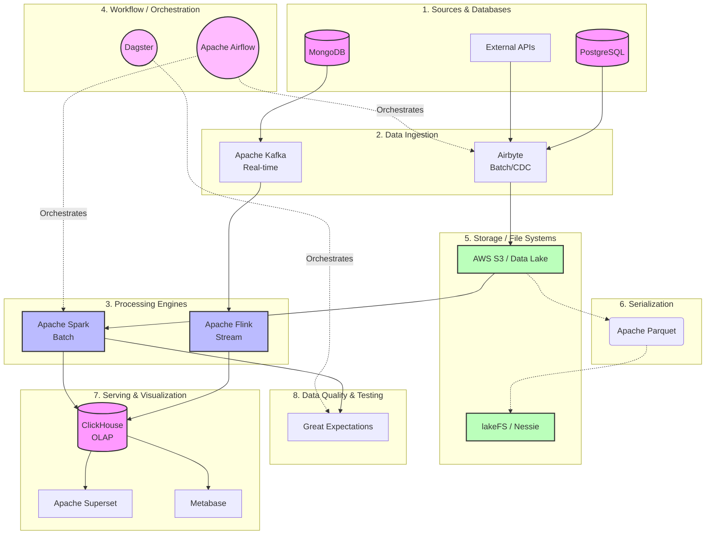

Here is the category-wise ranking of topics from the Awesome Data Engineering repository, along with descriptions of what they do, how they help us, top picks, and neatly organized diagrams.

### 1. Databases
**Description:** The foundational layer where structured, semi-structured, and unstructured data is stored, managed, and queried. Includes Relational, Key-Value, Columnar, Document, Graph, and Timeseries databases.
**How it helps us:** They are the core engines of data engineering, enabling persistent storage, rapid retrieval, and complex querying of data to serve downstream applications and analytics.
**Top Picks:**
- *Relational:* PostgreSQL
- *Columnar:* ClickHouse
- *Document:* MongoDB
- *Timeseries:* InfluxDB

### 2. Data Ingestion
**Description:** Tools and frameworks for extracting data from various sources (databases, APIs, logs, events) and moving it to a storage system like a data warehouse or lake.
**How it helps us:** Automates the reliable transfer of data (batch or real-time) from source to destination, ensuring data is available for processing and analysis without loss.
**Top Picks:** Kafka, Airbyte, dlt, Fivetran/Meltano

### 3. Stream & Batch Processing
**Description:**
- *Stream Processing:* Handling and computing continuous streams of data in real-time.
- *Batch Processing:* Processing large, bounded datasets in scheduled jobs.
**How it helps us:** Allows us to transform, clean, and aggregate data. Stream processing gives low-latency insights (e.g., fraud detection), while batch processing handles massive historical data workloads.
**Top Picks:**
- *Stream:* Apache Flink, Apache Spark Streaming
- *Batch:* Apache Spark, Hadoop MapReduce

### 4. Workflow / Orchestration
**Description:** Systems used to author, schedule, and monitor data pipelines and complex Directed Acyclic Graphs (DAGs) of tasks.
**How it helps us:** Manages dependencies, handles retries on failure, and provides observability into pipeline health, ensuring that tasks run in the correct order and data is delivered reliably.
**Top Picks:** Apache Airflow, Dagster, dbt (for transformation workflows)

### 5. File System & Data Lake Management
**Description:** Distributed file systems and object stores (like S3 or HDFS) and the management platforms (like LakeFS) built on top of them to organize data lakes.
**How it helps us:** Provides cheap, massively scalable storage for raw data and enables Git-like versioning, governance, and ACID transactions (via formats like Iceberg) on data lakes.
**Top Picks:** AWS S3, HDFS, lakeFS, Project Nessie

### 6. Serialization Formats
**Description:** Standardized binary and columnar data formats used for storing and transmitting data efficiently.
**How it helps us:** Dramatically reduces storage costs and I/O bottlenecks during analytical queries by compressing data and allowing column-level reads.
**Top Picks:** Apache Parquet, Apache Avro

### 7. Charts, Dashboards & Analytics
**Description:** Business Intelligence (BI) and visualization tools that connect to data warehouses to create reports and interactive dashboards.
**How it helps us:** Transforms raw data into actionable insights, enabling stakeholders and decision-makers to understand metrics visually.
**Top Picks:** Apache Superset, Metabase

### 8. Testing, Profiling & Data Quality
**Description:** Frameworks for testing data integrity, monitoring schema drift, profiling distributions, and ensuring data contracts are met.
**How it helps us:** Prevents "garbage in, garbage out." By validating data pipelines, it ensures trustworthiness of the data reaching end users.
**Top Picks:** GreatExpectations, DQOps

---

### Neatly Organized Architecture Diagram

Here is a Mermaid diagram showing how these top picks form a modern Data Engineering stack:

### Summary of How This Architecture Helps Us:
1. **Scalability:** By decoupling storage (S3) from compute (Spark/Flink), you can scale them independently.
2. **Reliability:** Using orchestrated ingestion (Airflow/Airbyte) alongside robust serialization (Parquet) and data quality tests (GreatExpectations) ensures high fidelity.
3. **Speed to Insight:** Streaming pipelines (Kafka -> Flink -> ClickHouse) provide real-time dashboards (Superset), while batch pipelines train ML models and compile daily reports.
